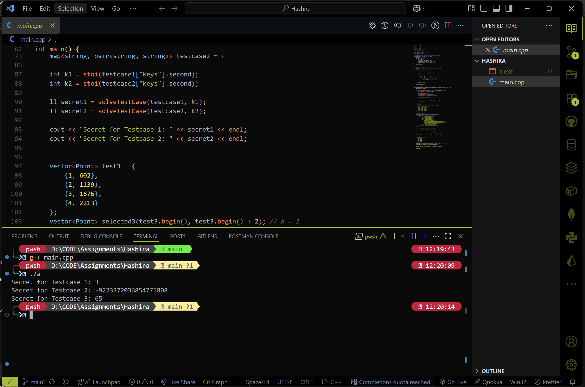

# Code

``` cpp


#include <iostream>
#include <vector>
#include <cmath>
#include <map>
#include <string>
#include <cctype>
using namespace std;

using ll = long long;
using Point = pair<ll, ll>;

// Convert a string number in arbitrary base to decimal
ll decode(const string& val, int base) {
    ll result = 0;
    for (char ch : val) {
        int digit;
        if (isdigit(ch)) digit = ch - '0';
        else digit = tolower(ch) - 'a' + 10;
        result = result * base + digit;
    }
    return result;
}

// Lagrange interpolation to find f(0)
ll lagrangeInterpolation(const vector<Point>& points) {
    long double result = 0.0;
    int k = points.size();

    for (int i = 0; i < k; ++i) {
        long double xi = points[i].first;
        long double yi = points[i].second;
        long double term = yi;

        for (int j = 0; j < k; ++j) {
            if (i != j) {
                long double xj = points[j].first;
                term *= (0.0 - xj) / (xi - xj);
            }
        }
        result += term;
    }
    return round(result);
}

ll solveTestCase(const map<string, pair<string, string>>& testData, int k) {
    vector<Point> points;

    for (auto it = testData.begin(); it != testData.end(); ++it) {
        if (it->first == "keys") continue;

        ll x = stoll(it->first);
        int base = stoi(it->second.first);
        ll y = decode(it->second.second, base);

        points.push_back({x, y});
    }

    vector<Point> selected(points.begin(), points.begin() + k);
    return lagrangeInterpolation(selected);
}

int main() {
    // First Test Case
    map<string, pair<string, string>> testcase1 = {
        {"keys", {"4", "3"}},
        {"1", {"10", "4"}},
        {"2", {"2", "111"}},
        {"3", {"10", "12"}},
        {"6", {"4", "213"}}
    };

    // Second Test Case
    map<string, pair<string, string>> testcase2 = {
        {"keys", {"10", "7"}},
        {"1", {"6", "13444211440455345511"}},
        {"2", {"15", "aed7015a346d63"}},
        {"3", {"15", "6aeeb69631c227c"}},
        {"4", {"16", "e1b5e05623d881f"}},
        {"5", {"8", "316034514573652620673"}},
        {"6", {"3", "2122212201122002221120200210011020220200"}},
        {"7", {"3", "20120221122211000100210021102001201112121"}},
        {"8", {"6", "20220554335330240002224253"}},
        {"9", {"12", "45153788322a1255483"}},
        {"10", {"7", "1101613130313526312514143"}}
    };

    int k1 = stoi(testcase1["keys"].second);
    int k2 = stoi(testcase2["keys"].second);

    ll secret1 = solveTestCase(testcase1, k1);
    ll secret2 = solveTestCase(testcase2, k2);

    cout << "Secret for Testcase 1: " << secret1 << endl;
    cout << "Secret for Testcase 2: " << secret2 << endl;


    vector<Point> test3 = {
        {1, 602},
        {2, 1139},
        {3, 1676},
        {4, 2213}
    };
    vector<Point> selected3(test3.begin(), test3.begin() + 2); // k = 2
    ll secret3 = lagrangeInterpolation(selected3);

    cout << "Secret for Testcase 3: " << secret3 << endl;

    return 0;
}


```
# Output


